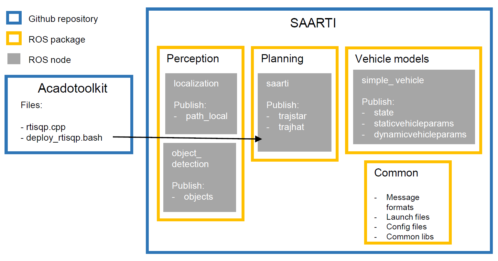

## TAMP: Workspace for developing traction adaptive motion planning using sampling augmented adaptive RTI

### Setup instructions  

System configuration: ubuntu 16.04 LTS & ROS Kinetic   
https://www.ubuntu.com/download/alternative-downloads   
http://wiki.ros.org/kinetic/Installation   

clone the repo

clone https://github.com/larsvens/acado_fork

checkout stable branch `git checkout --track origin/stable`

follow the instructions to deploy rti-sqp code to [...]tamp_ws/src/planning/

clone catkin simple into src https://github.com/catkin/catkin_simple.git

compile by running `catkin_make` from root of this repo

### Run instructions
cd to root of the repo

`source devel/setup.bash`

`roslaunch single_experiment.launch`
